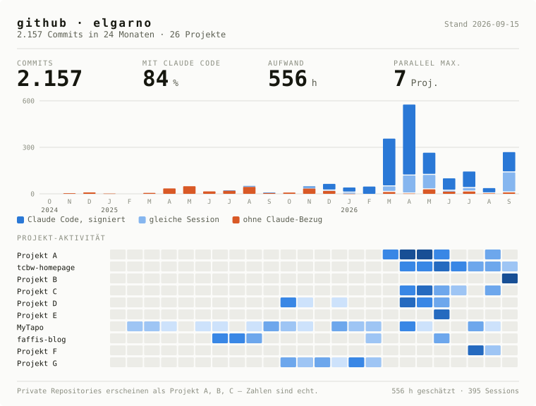

### Fabian Wörenkämper

Full Stack Data Science bei Tag, zu viele Nebenprojekte bei Nacht.

<picture>
  <source media="(prefers-color-scheme: dark)" srcset="profile-banner-dark.svg">
  
</picture>

Monatlich neu gebaut aus der Commit-Historie aller eigenen Repositories.
Private Projekte erscheinen unter Pseudonym; die Zahlen sind unverändert.
[Interaktive Fassung →](https://gh-stats.faffi.workers.dev)
